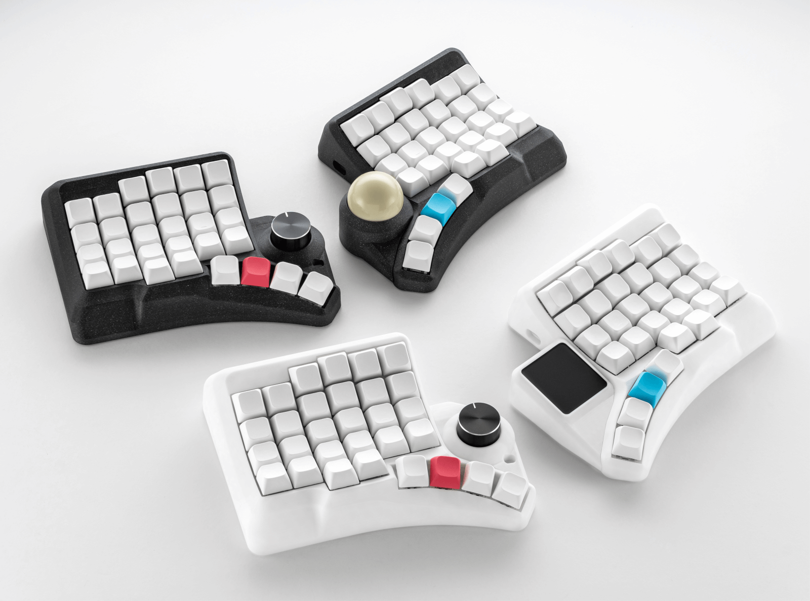
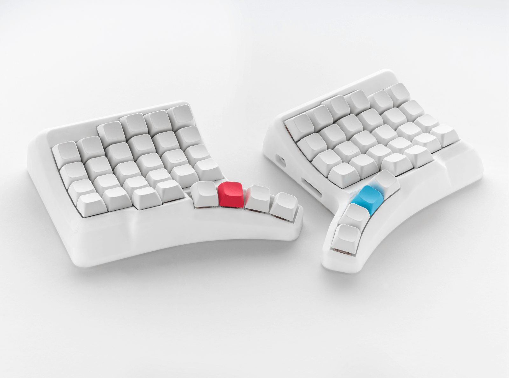
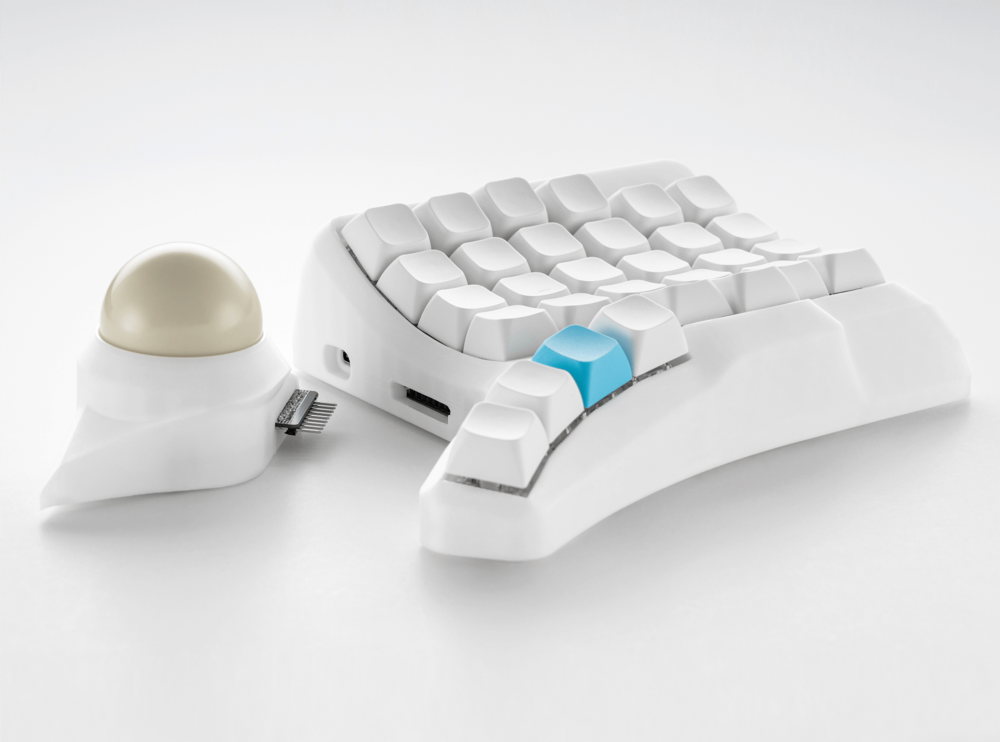
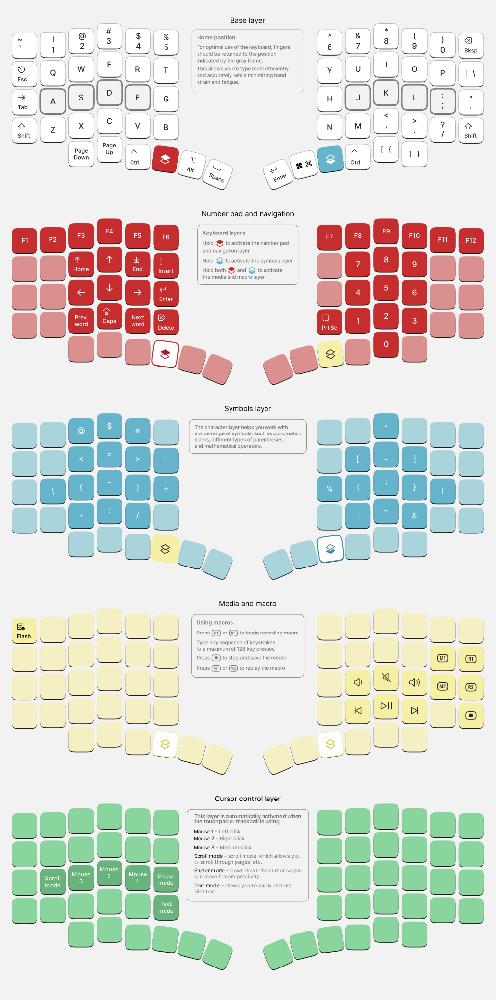

## High Plains Drifter is a modular, curved mechanical keyboard that is ready to change the way you think about ergonomics in typing!  
*Innovative design that allows easy access to all keys, and specially designed modules that make the keyboard a unique tool, exclusively for your purpose*

## Design philosphy
This keyboard was designed with FDM printing in mind, the goal was to create a perfect curved case that can be easily printed and looks aesthetically pleasing with minimal amount of so called "steps" that plague similar 3D keyboards like Dactyl Manuform, it's design is similar to the [Velvet v3](https://github.com/ergohaven/velvet) keyboard but with 60% layout and addition of various interchangeable modules

## Features
- Modular, ergonomic 3D design
- 60 fully programmable keys, 15 additional layers for all your tasks
- Powered by RP2040 Zero and QMK firmware
- Hotswappable PCB (MX sockets) 
- Type-C output for connection between halves
- Easily remap any key and customize your keyboard with [Vial](https://get.vial.today/) 
- [Firmware](https://github.com/ergohaven/keymap_hub) is being constantly updated, get the latest QMK features for your keyboard from us ♥️  

## This repo contains all files related to this keyboard
PCB and schematic can be found [here](https://oshwlab.com/yuriiq/hpdv2)

### Build guide
Coming soon

### BOM
#### Switchplate + thumb keys + MCU holder
- 2   RP2040 Zero MCU
- 60 MX Hotswap sockets
- 60 1N4148W Diodes (SOD-123)
- 2   Male Pin Header Connector: 11 Pins, 2.54mm, 90 degree
- 2   Female Header Sockets: 11 Pins, 2.54mm, 90 degree
- 2   Female Header Sockets: 9 Pins, 2.54mm, 90 degree
- 4   Socket SH1.0 5 Pins, 1.00mm
- 2   Cable connector SH1.0 5 Pins, 1mm, 100mm, double head
- 2   1 - 100 kOhm resistors (0805)
- 2   USB Type-C daughterboard: 1.6mm thick
- 32 M2x4 Screws
- 10 M3x5 Inserts
- 10 M3x4 Screws
- 4 Magnets (5х10х2mm)
- 4 3M bumpons (8mm)

#### Encoder module
- 1 Encoder EC11
- 1 Encoder cap
- 1 Male Pin Header Connector: 9 Pins, 2.54mm, 90 degree
- 1 1N4148W Diodes (SOD-123)
- 1 LED SK6812 mini-e
- 2 Magnets (5х10х2mm)
- 2 3M bumpons (8mm)

#### Touchpad module
- 1 Azoteq TPS43
- 1 Male Pin Header Connector: 9 Pins, 2.54mm, 90 degree
- 1 Connector PH2.0 4 pins, 2mm, 90 degree
- 1 Cable connector PH2.0 4 Pins, 2mm, 6mm, one head
- 2 Magnets (5х10х2mm)
- 1 plate 40x43x1 mm with rounding 3mm
- 1 PVC 40x43 mm sticker with rounding 3mm
- 2 3M bumpons (8mm)

#### Trackball module
- 1 PWM3389 sensor
- 1 TPS73601DBVR
- 1 Male Pin Header Connector: 9 Pins, 2.54mm, 90 degree
- 1 Resistor 0805 10 kOm
- 1 Resistor 0805 39 Om
- 1 Resistor 0805 37.4 kOm
- 1 Resistor 0805 63.4 kOm
- 3 Capacitor 0805 100 nF
- 1 Capacitor 0805 1 uF
- 1 Capacitor 0805 4.7 uF
- 1 Capacitor 0805 10 uF
- 2 Magnets (5х10х2mm)
- 2 3M bumpons (8mm)
- 38mm billiard ball
- 3 bearings (6x2.5mm)
- 3 screws (M3x8)

## License 

The files in this repository are licensed under a Creative Commons Attribution-NonCommercial-ShareAlike 4.0 International License.

## Firmware
- [Pre-compiled files][1]
- [Source code][2]

[1]: https://github.com/ergohaven/keymap_hub
[2]: https://github.com/ergohaven/vial-qmk/tree/vial/keyboards/ergohaven

## Availability
The complete keyboard (not a diy kit!) is available for purchase at [ergohaven.xyz](https://ergohaven.xyz/shop)
