# HPD v2 - how to assemble it yourself

## Components:

### Main keyboard case

-   1 pc. Switchplate PCB (FR4, 0.8mm thickness)
-   1 pc. Thumb cluster PCB (FR4, 0.8mm thickness)
-   1 pc. MCU holder PCB (FR4, 1mm thickness)
-   1 pc. 3D printed case (right and left halves)
-   2 pcs. RP2040 Zero MCU [(example)](https:aliexpress.ru/item/1005008447219836.html?sku_id=12000045180795185&spm=a2g2w.productlist.search_results.2.11fa5bf7dfP3y0)
-   60 pcs. MX Hotswap Sockets [(example)](https://aliexpress.ru/item/32965920593.html?sku_id=10000014425721931&spm=a2g2w.productlist.search_results.14.59c979f1dQrDJ8)
-   60 pcs. 1N4148W Diodes (SOD-123) [(example)](https://aliexpress.ru/item/1005008585308341.html?sku_id=12000045839144539&spm=a2g2w.productlist.search_results.0.4a7521a1FSq2Fa)
-   2 pcs. PLS pin connectors, male: 11 Pins, 2.54mm, 90 degree [(example)](https://aliexpress.ru/item/1005003912826649.html?spm=a2g2w.detail.rcmdprod.6.432d58d7GxW4nu&mixer_rcmd_bucket_id=UnknownMixerAbId&pdp_trigger_item_id=0_1005008592294666&ru_algo_pv_id=597bb7-61b690-22faee-47ad94-1743001200&scenario=aerSimilarItemPdpRcmd&sku_id=12000027451167444&traffic_source=recommendation&type_rcmd=core)
-   2 pcs. PBS sockets for connectors, female: 11 Pins, 2.54mm, 90 degree [(example)](https://aliexpress.ru/item/1005007724558861.html?spm=a2g2w.detail.rcmdprod.11.1efb4c9e6CqbCe&mixer_rcmd_bucket_id=UnknownMixerAbId&pdp_trigger_item_id=0_1005003912826649&ru_algo_pv_id=597bb7-61b690-22faee-1bc9bf-1743001200&scenario=aerSimilarItemPdpRcmd&sku_id=12000041989747255&traffic_source=recommendation&type_rcmd=core)
-   2 pcs. PBS sockets for connectors, female: 9 Pins, 2.54mm, 90 degree [(example)](https://aliexpress.ru/item/1005007724558861.html?spm=a2g2w.detail.rcmdprod.11.1efb4c9e6CqbCe&mixer_rcmd_bucket_id=UnknownMixerAbId&pdp_trigger_item_id=0_1005003912826649&ru_algo_pv_id=597bb7-61b690-22faee-1bc9bf-1743001200&scenario=aerSimilarItemPdpRcmd&sku_id=12000041989747255&traffic_source=recommendation&type_rcmd=core)
-   4 pcs. SH1.0 5 Pins, 1.00mm connectors [(example)](https://aliexpress.ru/item/1005005552109946.html?sku_id=12000033513026842&spm=a2g2w.productlist.search_results.2.6a7a33abufJE93)
-   2 pcs. SH1.0 5 Pins, 1mm, 100mm, double head cable-connector [(example)](https://aliexpress.ru/item/4000820462275.html?sku_id=12000046260055228&spm=a2g2w.productlist.search_results.0.3c12424esjC6IV)
-   2 pcs. 1-100kOhm resistors (0805) [(example)](https://aliexpress.ru/item/1005004542018347.html?sku_id=12000029542986632&spm=a2g2w.productlist.search_results.2.727b1be19xabCU)
-   4 pcs. Magnets n52 5x10x2 mm [(example)](https://aliexpress.ru/item/1005001564760861.html?sku_id=12000039046985487&spm=a2g2w.productlist.search_results.2.439915f0iwf2ym)
-   2 pcs. USB Type-C mini-plate: 1.6mm thick [(example)](https://aliexpress.ru/item/1005005857575118.html)
-   32 pcs. M2x4 Screw [(example)](https://aliexpress.ru/item/1005005898007060.html)
-   10 pcs. M3x4 Brass Inserts [(example)](https://aliexpress.ru/item/1005004290019650.html)
-   10 pcs. M3x4 Screw [(example)](https://aliexpress.ru/item/1005005898007060.html)
-   1 pc. Type-C to Type-C cable (for connecting halves)
-   8 pcs. 3M bumpons/Silicone legs [(example)](https://aliexpress.ru/item/32912066603.html)
-   60 pcs. MX switches
-   60 pcs. Key caps

### Modules

#### Encoder 

-   1 pc. PCB (FR4, 1mm thickness)
-   1 pc. 3D printed case
-   1 pc. EC11 Encoder
-   1 pc. PLS pin connectors, male: 9 Pins, 2.54mm, 90 degree [(example)](https://aliexpress.ru/item/1005005614848270.html)
-   1 pc. 1N4148W Diode (SOD-123)
-   1 pc. LED sk6812 mini-e
-   2 pcs. Magnets n52 5x10x2 mm
-   2 pcs. 3M bumpons/silicone legs [(example)](https://aliexpress.ru/item/32912066603.html)
-   1 pc. Knob for EC11 Encoder, Diameter 26mm, Height 17mm
-   2 pcs. LED insert (for Galaxy black case)

#### Touchpad 

-   1 pc. PCB (FR4, 1mm thickness)
-   1 pc. 3D printed case
-   1 pc. Azoteq TPS43 Touchpad
-   1 pc. PLS pin connectors, male: 9 Pins, 2.54mm, 90 degree [(example)](https://aliexpress.ru/item/1005005614848270.html)
-   1 pc. PH2.0 4 pins, 2mm, 90 degree connector
-   1 pc. PH2.0 4 Pins, 2mm, 6mm, one head cable-connector
-   2 pcs. Magnets n52 5x10x2 mm
-   2 pcs. 3M bumpons/Silicone legs [(example)](https://aliexpress.ru/item/32912066603.html)
-   1 pc. Touchpad surface 40x43x1 mm with 3mm rounded corners
-   1 pc. Touchpad protective film PVC 40x43 mm with 3mm rounded corners

#### Trackball 

-   1 pc. PCB (FR4, 1mm thickness)
-   1 pc. 3D printed case
-   1 pc. PMW3389DM sensor + lens
-   1 pc. TPS73601DBVR (Voltage Regulator)
-   1 pc. PLS pin connectors, male: 9 Pins, 2.54mm, 90 degree [(example)](https://aliexpress.ru/item/1005005614848270.html)
-   1 pc. Resistor 0805 10 kOhm
-   1 pc. Resistor 0805 39 Ohm
-   1 pc. Resistor 0805 37.4 kOhm
-   1 pc. Resistor 0805 63.4 kOhm
-   3 pcs. Capacitor 0805 100 nF
-   1 pc. Capacitor 0805 1 uF
-   1 pc. Capacitor 0805 4.7 uF
-   1 pc. Capacitor 0805 10 uF
-   2 pcs. Magnets n52 5x10x2 mm
-   2 pcs. 3M bumpons/Silicone legs [(example)](https://aliexpress.ru/item/32912066603.html)
-   1 pc. Ball 38 mm
-   3 pcs. Bearing balls steel/ceramic diameter 3mm

## Tools:

-   Soldering iron
-   Solder (flux-containing)
-   Nippers
-   Tweezers
-   Screwdriver for M3 and M2 screws
-   Pliers

## Assembly sequence

### Preparation of MCU Holders

1.  Installation of resistors
2.  Installation of the microcontroller
3.  Installation of Type-C connectors
4.  Installation of SH1.0 5 Pins, 1.00mm connectors
5.  Installation of PBS 11-Pin and 9-Pin sockets
6.  Microcontroller firmware

### Preparing the switchplate

1.  Applying solder to the pads
2.  Installation of hotswap sockets and diodes

### Preparing the thumb cluster PCB

1.  Installation of SH1.0 5 Pins, 1.00mm connectors
2.  Applying solder and installation of hotswap sockets and diodes

### Preparing the trackball module PCB

1.  Installation of the TPS73601DBVR IC
2.  Applying solder to the pads
3.  Installation of resistors and capacitors
4.  Installation of the PMW3389DM sensor
5.  Installation of PLS pin connectors
6.  Installation of the lens

### Preparing the encoder module PCB

1.  Installation of 1N4148W diodes (SOD-123)
2.  Installation of sk6812 mini-e LEDs
3.  Installation of PLS pin connectors
4.  Installation of the encoder

### Preparing the touchpad module PCB

1.  Installation of PLS pin connectors
2.  Installation of the PH2.0 4 pins, 2mm connector

### Main case assembly

1.  Installation of switches (initial set for alignment)
2.  Installation of the Thumb cluster PCB
3.  Installation of the Switchplate
4.  Installation of magnets into the case
5.  Installation of brass inserts
6.  Installation of the MCU holder
7.  Connecting the cable-connectors
8.  Installation of remaining switches and keyboard check
9.  Installation of the bottom plate and keycaps

### Encoder module assembly

1.  Installation of LED insert (Galaxy black case)
2.  Installation of magnets
3.  Installation of the PCB
4.  Installation of the cover, knob, and bumpons

### Trackball module assembly

1.  Installation of bearing balls
2.  Installation of magnets
3.  Installation of the PCB
4.  Installation of the cover and bumpons

### Touchpad module assembly

1.  Installation of the cable-connector
2.  Installation of the touchpad surface
3.  Installation of the touchpad into the case
4.  Installation of the PCB
5.  Installation of magnets
6.  Installation of the cover and bumpons

### Preparation of MCU holders

#### Installing resistors

First, you need to prepare the MCU Holder PCB. Install resistors on both holder halves. On the right half - onto the R3 pad, on the left - onto R2.

#### Installing the microcontroller

Do not mix up the installation side. Place the microcontroller level and first solder pins 0 and 13 to fix it on the board. After ensuring the microcontroller is aligned correctly, solder the remaining contacts.

#### Installing Type-C connectors

Place the Type-C mini-plate onto the holder PCB. Solder one pin of the PLS connector (which goes through the Type-C mini-plate and holder PCB) on the back side to temporarily fix it, as shown in Fig. 1.
Then, on the other side (top side), solder one pin of the Type-C connector itself to fix its position relative to the PLS connector, as shown in Fig. 2. Next, solder all pins of the PLS connector on the top side, as shown in Fig. 3.
Afterward, trim the excess legs of the PLS connector on the back side using nippers (Fig. 4) and solder the remaining pins of the Type-C connector on the back side (Fig. 5).

 
 
 
 
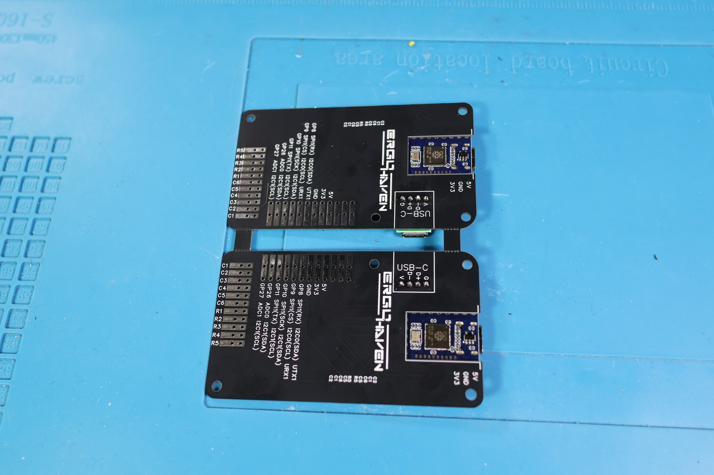 

#### Installing SH1.0 5 Pins, 1.00mm connectors

Apply solder to one of the large side pads to fix the connector's position
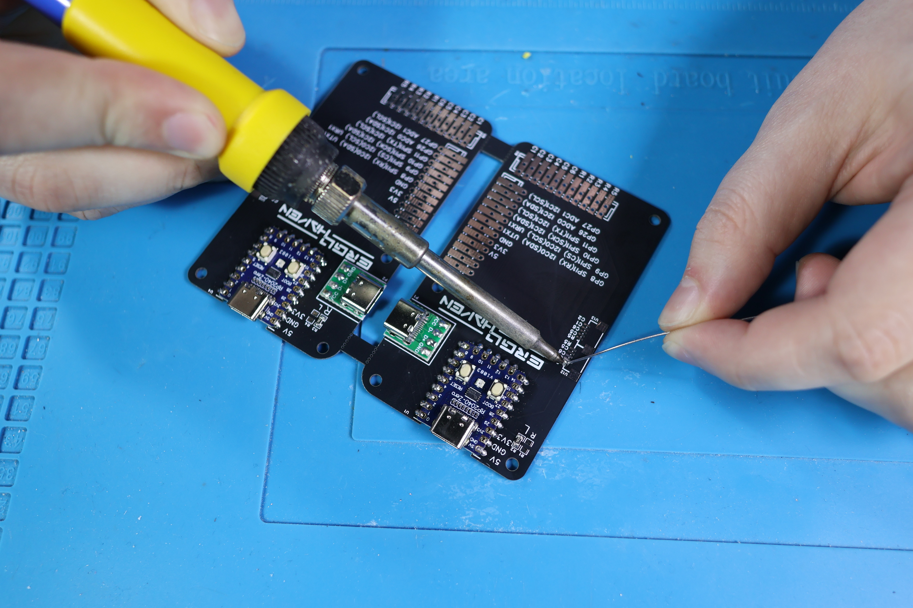

Place the connector and solder the remaining pins. Ensure the side mounting tabs are securely soldered for mechanical strength.

#### Installing PBS 11-Pin and 9-Pin sockets

Solder one end pin of the PBS 11-Pin socket first to fix its position. Then solder the remaining pins.

Then, solder the PBS 9-Pin sockets, positioning them as shown in the picture.

Afterward, trim the pins on the reverse side using nippers.

#### Microcontroller firmware

After finishing soldering the holders, you need to flash them:
-   Connect the microcontroller to the PC.
-   The microcontroller should be identified as a USB drive.
-   Drag and drop the [firmware file](https://github.com/ergohaven/keymap_hub/) onto it.
-   The microcontroller is flashed.

If your RP2040-Zero is not detected as a drive:
Hold down the 'Boot' button on the microcontroller while connecting the USB cable. Then repeat the step of dragging the `.uf2` firmware file.

### Preparing the switchplate

#### Applying solder to contact pads

First, prepare the PCB. Apply a small amount of solder to one pad for each component location (diodes and sockets). This makes soldering the components easier.

#### Installing hotswap sockets and diodes

Diodes have polarity; install them correctly. The cathode is marked with a white line on the diode. The PCB also has a silkscreen marking with a similar line. Solder "line to line".
All diodes must be installed in the same direction. Solder the diode first to the pre-tinned pad, then solder the other pad.

Next, install the hotswap sockets and solder them. Solder one pin first, check alignment, then solder the second pin.

### Preparing the thumb cluster PCB

#### Installing SH1.0 5 Pins, 1.00mm connectors

Solder the connector similarly to how it was done on the holder PCB. Pay attention that the side mounting tabs are securely soldered.

#### Applying solder and installing components

Apply solder to one pad for each diode and socket location. Install and solder the diodes (observing polarity) and hotswap sockets, just like on the main switchplate.

### Preparing the trackball module PCB

#### Installation of the TPS73601DBVR IC

Apply solder to the large central pad (thermal pad) to help fix the IC's position.

Next, position the IC correctly (check pin 1 indicator) and solder it.

#### Applying solder to contact pads

Apply solder to one pad for each resistor and capacitor location.

#### Installation of resistors and capacitors

Solder all resistors and capacitors according to the silkscreen markings. These components do not have polarity.

#### Installation of the PMW3389DM sensor

Position the sensor aligning the mark/notch on the sensor with the mark on the PCB ("mark to mark") as shown, and solder its pins.

#### Installation of PLS pin connectors

Solder one end pin first to fix the position. Then solder the remaining pins.

Trim the pins on the reverse side.

#### Installation of the lens

Peel off both protective films.

Place the lens onto the sensor alignment posts. Carefully melt the two plastic posts using the soldering iron tip to secure the lens to the sensor assembly.

### Preparing the encoder module PCB

#### Installation of 1N4148W diodes (SOD-123)

Solder the diodes, remembering the polarity ("line to line").

#### Installation of sk6812 mini-e LEDs

Apply solder to one pad for each LED location. The LED has one clipped/notched corner; align this corner with the key (white dot or similar mark) on the PCB silkscreen.

#### Installation of PLS pin connectors

Solder one end pin first to fix the position. Then solder the remaining pins. Trim the pins on the reverse side.

#### Installation of the encoder

Insert the encoder into the holes and solder its pins on the reverse side. Also, solder the two large mounting tabs for stability.

### Preparing the touchpad module PCB

#### Installation of PLS pin connectors

Solder one end pin first to fix the position. Then solder the remaining pins. Trim the pins on the reverse side.

#### Installation of the PH2.0 4 pins, 2mm connector

Place the connector according to the silkscreen outline on the PCB and solder its pins.

### Main body assembly

#### Installation of switches 

First, install switches into the case as shown in the picture. These will help align the PCBs.

#### Installation of the thumb cluster PCB

Place the thumb cluster PCB onto the switches and secure it with M2x4 screws.

#### Installation of the switchplate

Align the Switchplate over the installed switches. While pressing it firmly against the case, fasten one M2x4 screw near the thumb cluster area as shown.

Then, fasten the remaining M2x4 screws. The result should look like the picture.

#### Installation of magnets into the case

**Very important!** Ensure you maintain consistent polarity for the magnets. All magnets on the main case halves should have the *same pole* facing outwards. Magnets on the modules will need the *opposite pole* facing outwards to attract. Use one magnet to test the polarity of others before inserting.

Press the magnets into the designated holes using pliers, as shown.

#### Installation of brass inserts

Using a heated soldering iron, carefully press five M3x4 brass inserts into the holes around the perimeter of the case half, as shown. Apply gentle, steady pressure until the insert is flush with the plastic surface.

#### Installation of the MCU holder

Take the male PLS 11-Pin connector and insert it into the female PBS 11-Pin socket on the prepared MCU holder, as shown.

Position the MCU holder in the case and fasten the M3x4 screw as shown.

Next, while pressing the MCU holder down firmly, solder each pin of the male PLS connector to the corresponding pads on the Switchplate PCB.

#### Connecting the cable-connectors

Connect the Thumb cluster PCB to the MCU Holder PCB using the SH1.0 5-pin cable-connector.

#### Installation of remaining switches and keyboard check

After assembling both halves similarly, install all the remaining switches. Connect the two halves using the Type-C to Type-C cable and connect the keyboard to the PC.

Next, you need to check the keyboard:
-   Go to [Vial](https://get.vial.today/download/).
-   Click on the “Matrix tester” menu, then “Test Matrix” (or similar, depending on Vial version). If required, click "Unlock" and follow the on-screen instructions to enable configuration/testing.
-   Press each key and verify it registers correctly in the matrix tester.

If all keys work correctly, proceed to install the bottom plates.

#### Installation of the bottom plate and keycaps

Place the bottom plate onto the case half and fasten it using M3x4 screws. Then, apply the silicone legs.

Install your favorite keycaps!

### Encoder module assembly
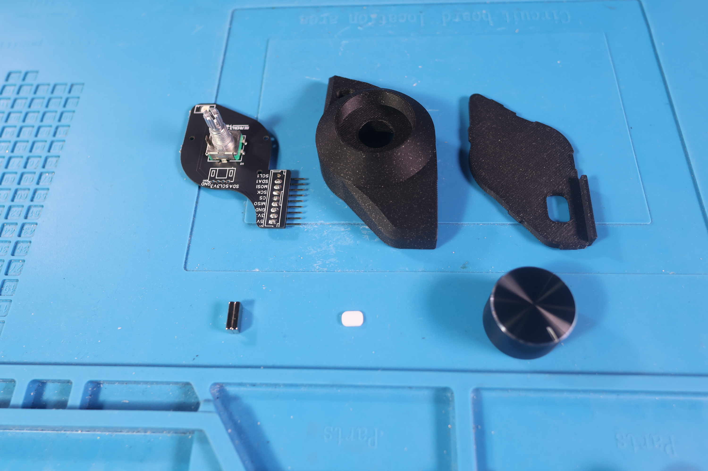

#### Installation of LED insert (Galaxy black case)

Press the LED insert (diffuser) into the hole for the LED, as shown.

#### Installation of magnets

Press the magnets into the holes. Remember: these magnets must have the opposite polarity facing outwards compared to the magnets on the main case.

#### Installation of the PCB

Place the prepared Encoder Module PCB into the module case and fasten it with two M2x4 screws.

#### Installation of the cover, knob, and bumpons

Snap the bottom cover into place. Apply the bumpons/silicone legs. Press the encoder knob onto the encoder shaft.

### Trackball module assembly

#### Installation of bearing balls

Using tweezers, carefully place one 3mm bearing ball into each of the three sockets. Then, use the main 38mm trackball to gently press each bearing ball fully into its socket, one at a time.
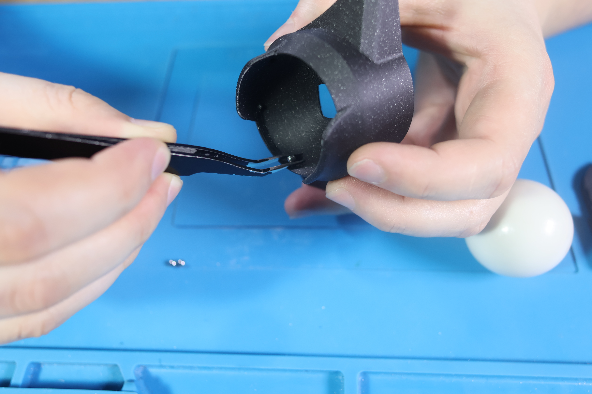
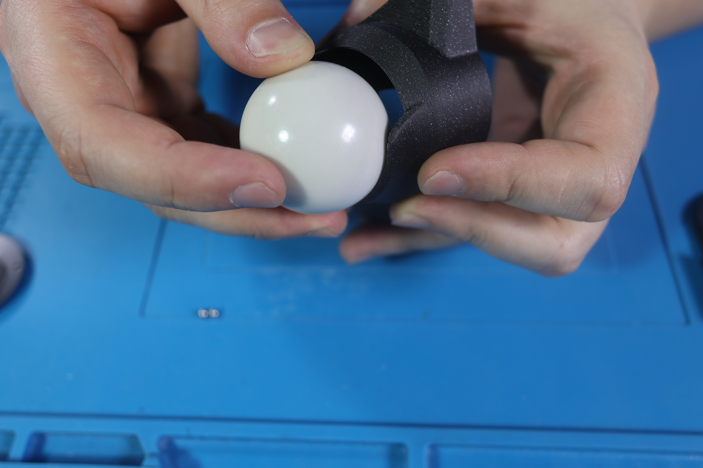
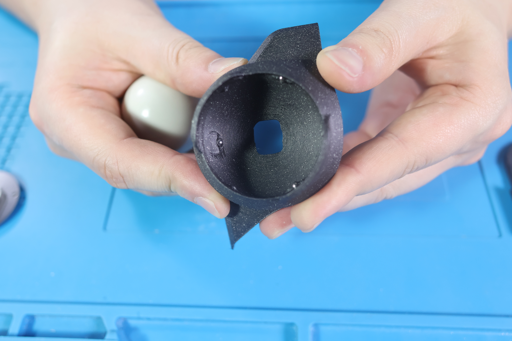

#### Installation of magnets

Press the magnets into the holes. Ensure opposite polarity to the main body magnets.

#### Installation of the PCB

Place the prepared Trackball Module PCB into the module case and secure it with two M2x4 screws.

#### Installation of the cover and bumpons

Snap the bottom cover into place. Apply the bumpons/silicone legs. Place the 38mm main ball onto the bearing balls.

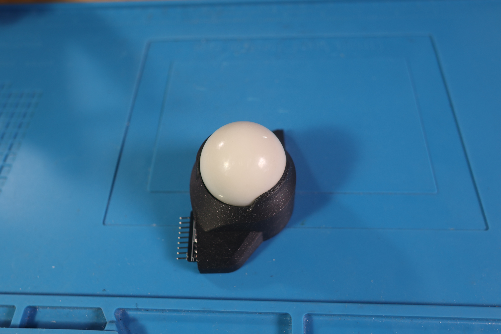

### Touchpad Module Assembly
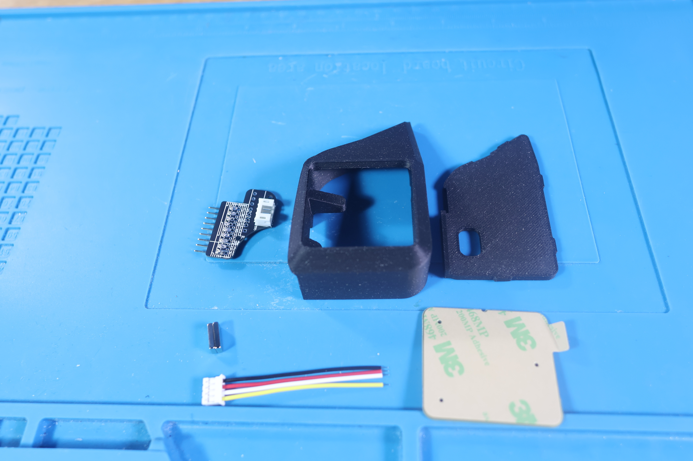

#### Installation of the cable-connector

Solder the PH2.0 cable-connector wires to the Azoteq TPS43 touchpad PCB as shown. Optionally, apply hot glue over the solder points.

#### Installation of the touchpad surface

Peel off the protective films from the touchpad surface piece and the Azoteq touchpad itself. Carefully adhere the surface piece to the touchpad (the glue will already be applied to the touchpad).

#### Installation of the touchpad into the case

Place the assembled touchpad into the module case as shown. Route the cable carefully.

#### Installation of the PCB

Connect the PH2.0 cable from the touchpad to the connector on the prepared Touchpad Module PCB. Place the PCB into the case and secure it with M2x4 screws.

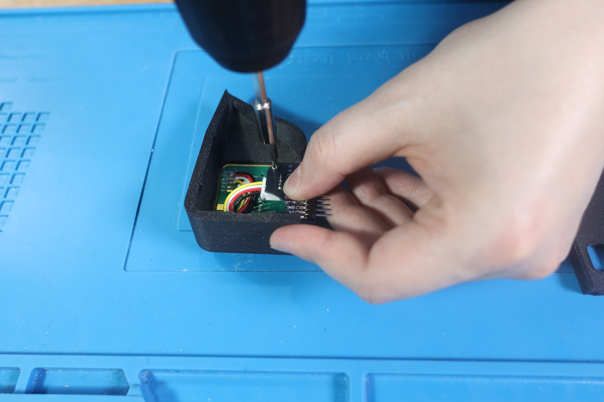
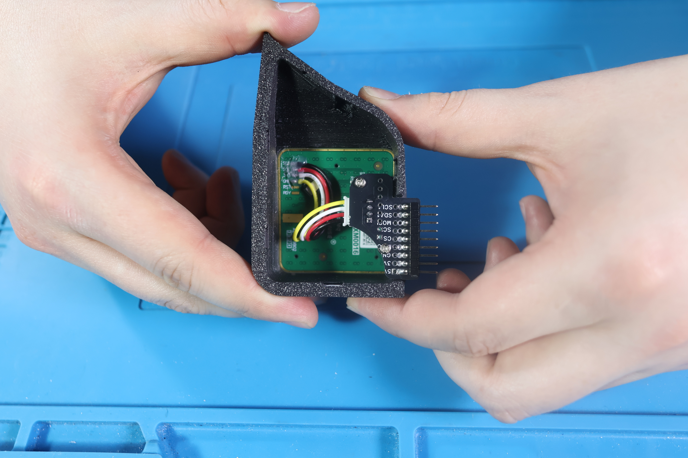

#### Installation of magnets

Press the magnets into the holes. Ensure opposite polarity to the main body magnets.
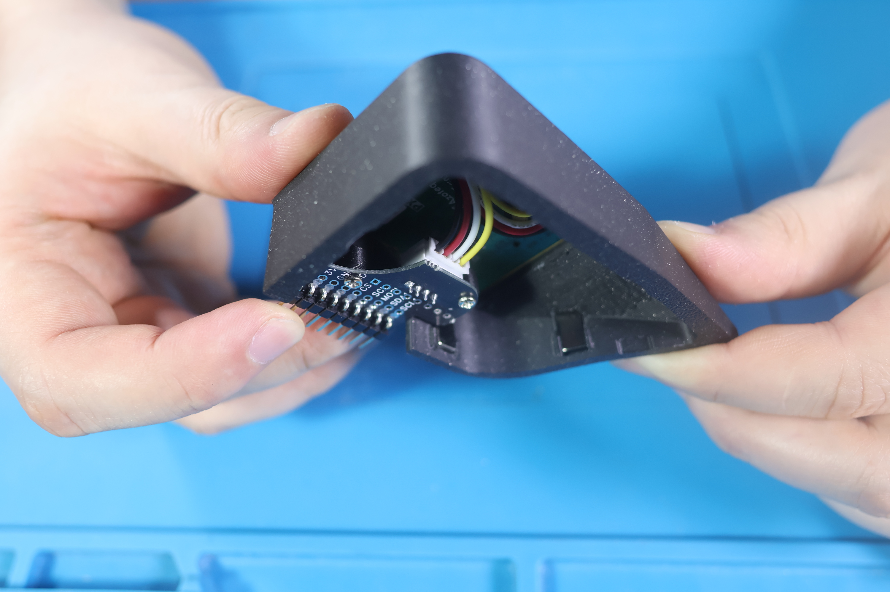

#### Installation of the cover and bumpons

Snap the bottom cover into place and apply the bumpons/silicone legs.

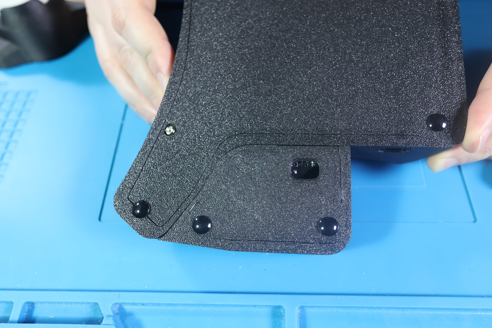

Your HPDv2 is ready! Enjoy the comfort and ergonomics!
